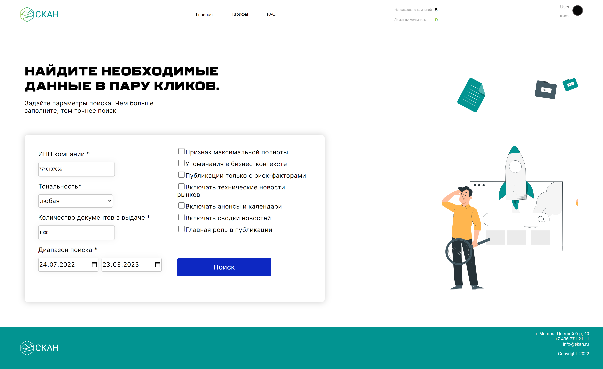
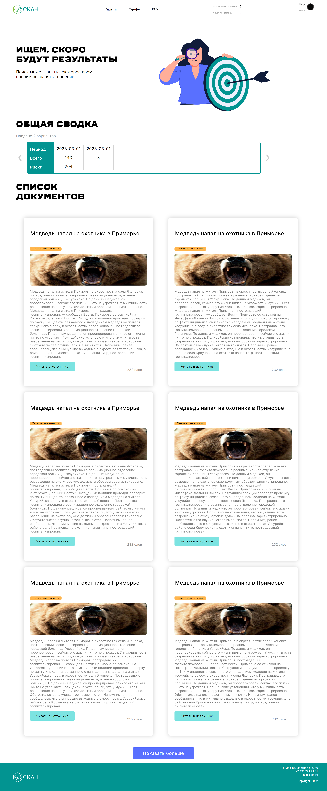

# SCAN

«СКАН» — система управления репутацией, созданная ведущим российским информационным агентством «Интерфакс». Сервис предназначен для менеджеров по PR, коммуникациям и специалистов по рискам и безопасности. Решает широкий спектр задач, связанных с медиааналитикой.

Система анализирует материалы СМИ и социальные медиа, оповещает о новых публикациях в режиме реального времени, автоматически формирует аналитические отчёты по любым запросам и инфоповодам, а также позволяет прогнозировать репутационные и экономические риски, связанные с партнёрами и контрагентами.

Целевая аудитория — бизнес и ИП, которым нужно проверить добросовестность подрядчиков на основе публичных данных.

.png)

.png)

